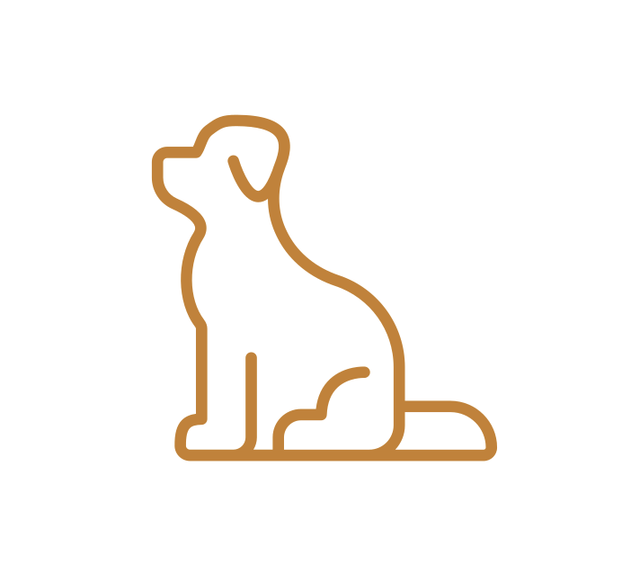

## My Story

Hi, I’m Audrey — a data analyst turned creator, passionate about exploring how technology, design, and empathy can shape better futures.

I started with data science and analytics, working on data collection, visualization, business insights, and predictive modeling. Over time, my curiosity expanded — from understanding systems to understanding people.

Now I build at the intersection of AI, mental health, and human-centered design. I founded Eudaimon — a nonprofit and safe space for individuals who are emotionally vulnerable to reclaim their voice. I’ve recently developed and launched the first version of our free AI-guided educational coach, offering gentle support for those who need it but can’t access traditional counseling.

I love exploring new technologies, business for good, and all forms of design — from interfaces to ideas.

📬 Connect: [LinkedIn](https://linkedin.com/in/weimengduan) | [EudaimonAI.org](https://EudaimonAI.org)

---

🐾 *With WangWang, every step.*  *In memory of my childhood dog — gone, but never lost.* 

---

## Skills

  

  

  

  

  

#### Currently Exploring **LangChain**, **LlamaIndex**, **OpenAI API**, and **Streamlit** — building Generative AI and AI-driven educational tools.

  
  
  

