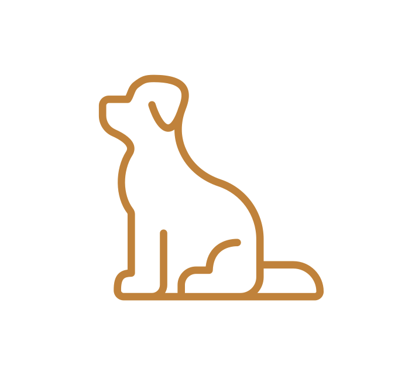

## My Story

I used to be a **data analyst** passionate about turning data into real-world impact. I worked on **data collection, cleaning, dashboarding, business performance analysis, predictive modeling, and data-driven storytelling** — transforming complex datasets into actionable insights.

These skills shaped how I see the world: I love **uncovering hidden patterns**, finding **fundamental reasons**, and providing **thoughtful solutions**. Over time, technical work felt too narrow — it couldn’t satisfy my curiosity about human experience.

I began to **travel, study, and write**. I became a **blogger and a novel author**, observing life as both participant and witness. Eventually, I was called to found **[Eudaimon](https://EudaimonAI.org)**, a nonprofit organization and a **safe space for individuals to reclaim their voice**. I’m now developing a **free guided educational chatbot** to provide mental health support for those who need it but can’t afford traditional counseling.

If you’d like to chat about potential collaborations, feel free to connect with me on [LinkedIn](https://linkedin.com/in/weimengduan).

---

## Skills

  

  

  

  

  

#### Currently Exploring **LangChain**, **LlamaIndex**, **OpenAI API**, and **Streamlit** — building Generative AI and AI-driven educational tools.

  
  
  

---

🐾 *With WangWang, every step.*  *In memory of my childhood dog — gone, but never truly gone.* 

